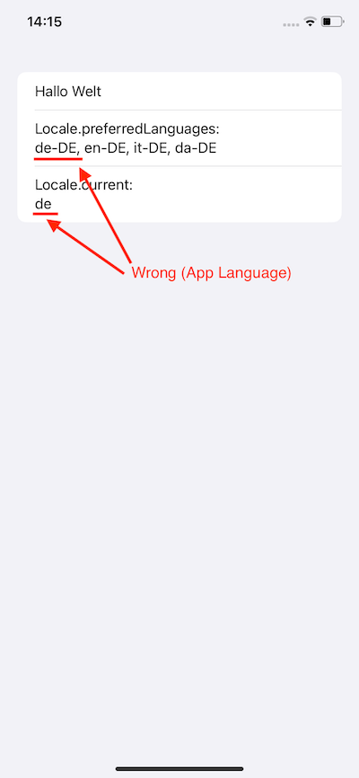

This is a sample app to demo the difficulties in obtaining the *device* language for a localized iOS App.

App Language is set to German:    

System / Device Language is set to English:   

Is there any API to obtain the system language (in this case English)?    

I have asked this question publicly at multiple places (without a solution so far):
- [Apple Developer Forums](https://developer.apple.com/forums/thread/745290)
- [Stack Overflow](https://stackoverflow.com/questions/77881437/localized-ios-app-obtain-device-language-not-app-language)